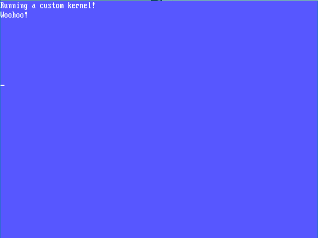

# Flakes

A tiny 32 bit kernel written in C with a simple driver to use VGA text mode buffer as output device  
Right now, all it does is paint the screen blue and displays some text

## Setup
You need to set up binutils and a gcc cross compiler. Instructions [here](http://wiki.osdev.org/GCC_Cross-Compiler)  
You're also going to need qemu to run the kernel  

Once that's done, to simply run  
```bash
$ ./build.sh
$ qemu-system-i386 -kernel myos.bin
```


